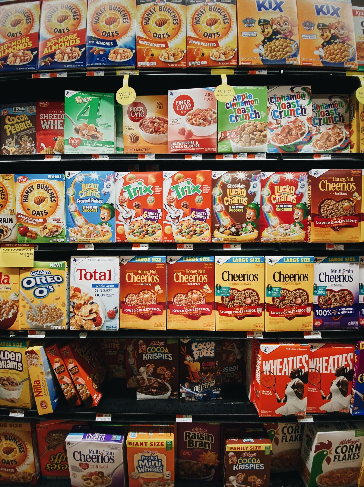
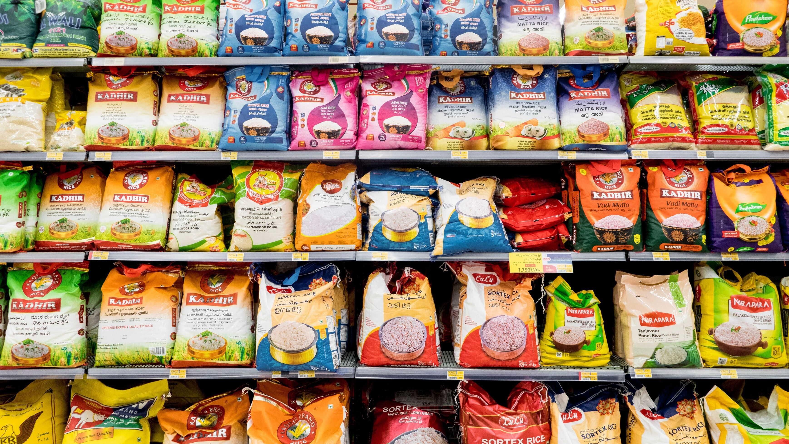
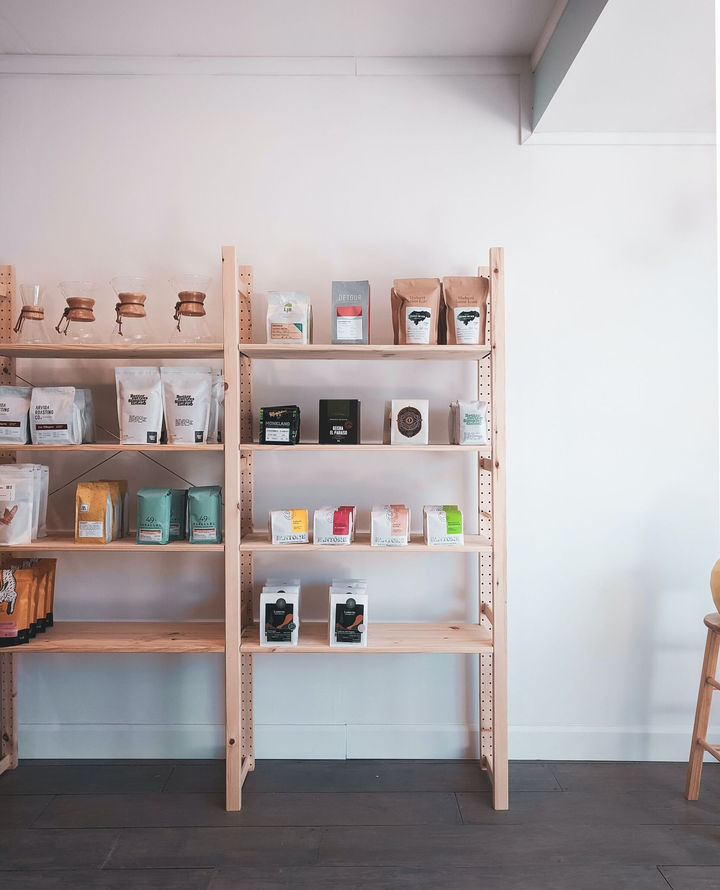
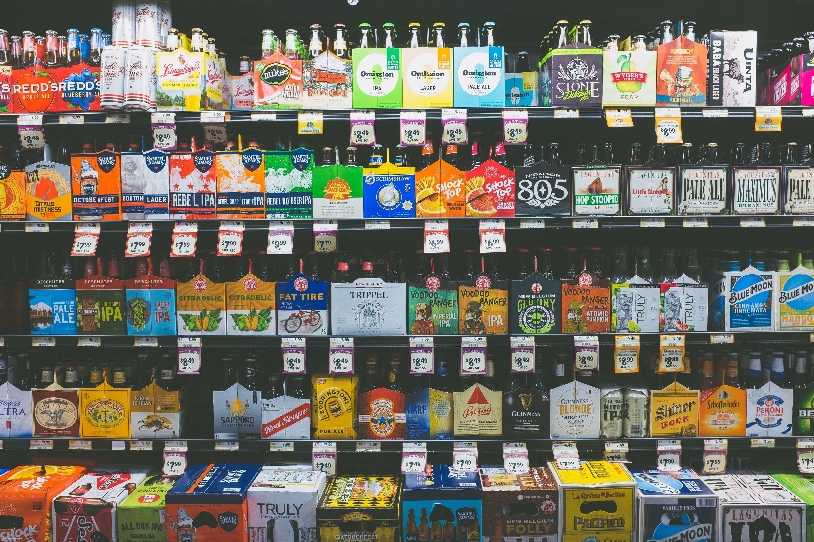
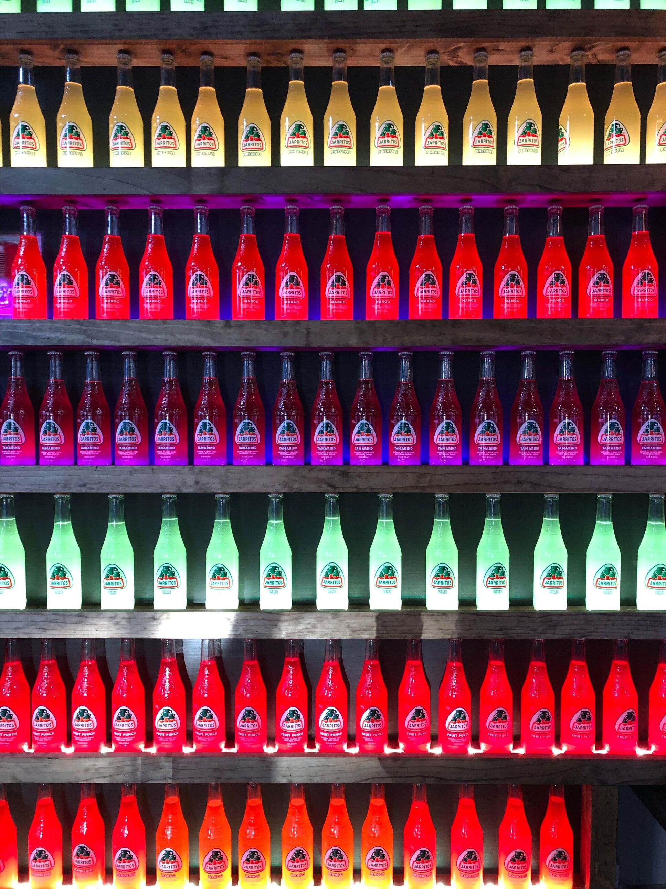
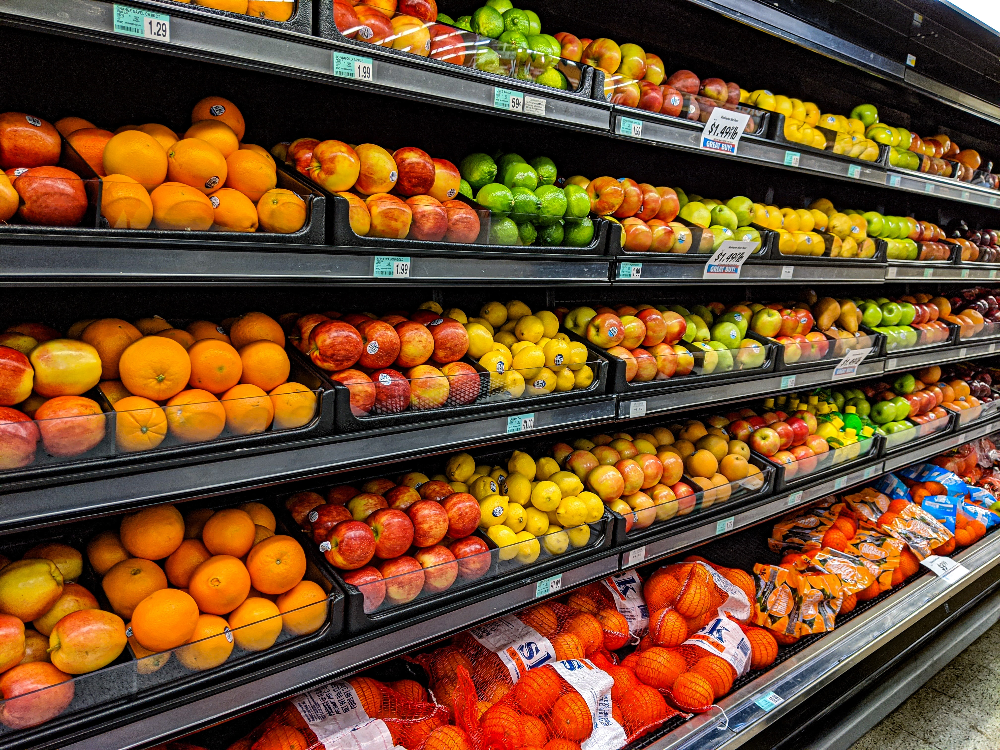

# Design Document

## Origin

    An application that enables you to collect all the data linked to your products and obtain all your key performance indicators in an instant.

    Our computer vision technology recognizes products and collects all visible data.

    This will give you a reliable and objective picture of the overall situation in shop.

### Goal
    1. Correctly detect SKUs on supermarket shelves (multiple object detection problem)
    2. Count the amount of SKU left.
    
    This way a manager will be able to keep track of their shop from their phone and receive all the statistics needed.

## Modeling

    We will divide this task into to subsequent tasks

    Camera => Object detection model => Counting Model => Results

### Counting Model

Ideas:

    1. Compute size of a detected object and detect empty space behind it. If there is no empty space is detected then we 
    could approximatly compute the number of SKU.

        Detected SKU:
            1. Size (width, height, length)
            2. Empty space behind (classification problem or regression problem)
                Space behind can be not completely empty therefore for accuracy we should continue with a regression problem.
                A model will predict values from 0-1. 1 - no empty space, 0 - nothing behind SKU

                In vast majority of cases there is no light behind the SKU:
                    1. We could use telephone flash BUT! most of the images from the internet won't have it therefore we have
                        a problem with collecting dataset.

    2. ...

### Object detection

#### Dataset 

https://drive.google.com/file/d/1iq93lCdhaPUN0fWbLieMtzfB1850pKwd/edit

https://www.kaggle.com/datasets/humansintheloop/supermarket-shelves-dataset

    We will take images of shelves from the internet. In case of need to annotate we will use makesence.ai.

Let's define some of the most common cases that might occur in our dataset.

1. Standard primitive form
    
        The problem with these forms is that it is easy to put the the way so we couldn't identify what is behind them
        (Very dense, no space between)

    - Square/rectangle

    

    - cylinder

    

2. Complex forms

    - Square frustum

    
    

3. Package

        The form might be similar to rectagle but it might vary.
        (Also very dense, little space between)

    
    

4. Bottles
    
    - Packed together 

    

    - Single unit

    
    

5. Fruits and Vegetables

        Hight entropy

    
